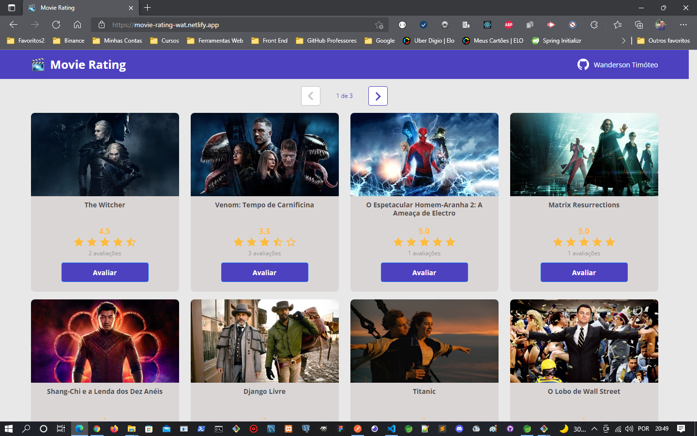
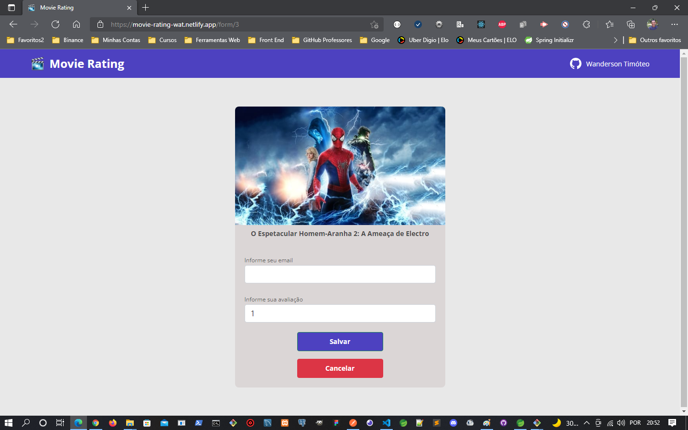
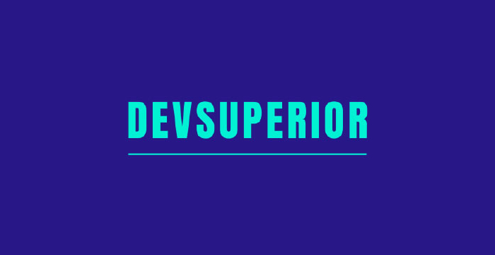

<h1 align="center">
    
</h1>

<p align="center">
  <a href="#-projeto">Projeto</a>&nbsp;&nbsp;&nbsp;|&nbsp;&nbsp;&nbsp;
  <a href="#-tecnologias">Tecnologias</a>&nbsp;&nbsp;&nbsp;|&nbsp;&nbsp;&nbsp;
  <a href="#-executar aplicação">Executar Aplicação</a>&nbsp;&nbsp;&nbsp;|&nbsp;&nbsp;&nbsp;
  <a href="#-licença">Licença</a>
</p>

<p align="center">
 

  
</p>
<br>

## 💻 Projeto

Esta aplicação chama-se Movie Rating, consiste em um sistema para realizar avaliação de filmes. 💜
<br><br>
Nela você seleciona o filme para realizar a avaliação e então, preenchendo o formulário com seu e-mail e nota o sistema verifica se o e-mail já está cadastrado no sistema, caso não esteja, ele adiciona este no BD, caso já esteja cadastrado o sistema registra apenas a nota de sua avaliação.
<br><br>
O sistema não registra uma avaliação do mesmo filme duas vezes, pois ele valida que o e-mail já realizou uma avaliação anterior.
<br><br>
O banckend foi desenvolvido em Java e hospedado no Heroku, já o frontend foi desenvolvido com React e hospedado na Netlify. 💜

## Acessar o domínio do projeto no Netlify

Tenha paciência e aguarde um momento pois a hospedagem é gratuita e demora um pouco para carregar.

- [Movie Rating (Clique aqui)](https://movie-rating-wat.netlify.app/)

<br>

## Prévia vizualização do sistema

<br>

Pagina inicial com a lista de filmes

<p align="center">
    
</p>

<br>

Pagina com o formulário para realizar a avaliação

<p align="center">
    
</p>
<br>

## 🚀 Tecnologias

Esse projeto foi desenvolvido com as seguintes tecnologias:

### Backend:

- [JAVA](https://www.java.com/pt-BR/)
- [Spring Tools Suite](https://spring.io/tools)
- [Spring Boot](https://spring.io/projects/spring-boot)
- [PostgreSQL](https://www.postgresql.org/)
- [Heroku](https://www.heroku.com/)

### Fronend:

- [React.js](https://reactjs.org/)
- [TypeScript](https://www.typescriptlang.org/)
- [HTML5](https://developer.mozilla.org/pt-BR/docs/Web/HTML/HTML5)
- [CSS3](https://www.tutorialspoint.com/css/css3_tutorial.htm)
- [Netlify](https://www.netlify.com/)
- [Figma](https://www.figma.com/)

### Design do projeto mo Figma

[Acesar o Figma do projeto](https://www.figma.com/file/hpQuzpGHq2MmrI87xnfMoT/DSMovie1)

<br>

## Executar Aplicação

### 🔥 Executando Localmente a Aplicação

Caso você deseja executar o projeto na sua máquina local, você precisará instalar o Java e o Node.js em sua máquina. Após a instalação, basta seguir os passos abaixo:

### 🌀 Começando...

Para começar, você deve simplesmente clonar o repositório do projeto na sua máquina e instalar as dependências.

#### ❗️ Instalando as Dependências (via Windows):

Abre o cmd (caso esteja utilizando o Windows) navegue até o local onde você clonou o projeto, exemplo:

```sh
cd "C:\Users\NomeDoComputador\Documents\clonedoprojeto"
```

Depois, quando estiver na pasta do projeto, basta acessar o projeto frontend na pasta `front-web` digitar no cmd a seguinte instrução: **(dentro da pasta `front-web` do projeto clonado)**

```sh
yarn install
```

Ao digitar a instrução acima, automaticamente ele irá baixar todas as dependências listadas e definidas no arquivo package.json:

- `node_modules` - que contêm os packages do npm que precisará para o projeto.

#### 💨 Executando a Aplicação

Bom, agora **(dentro da pasta `front-web` do projeto clonado)** abra um terminal para o projeto ser executado e digite:

```sh
yarn start
```

Pronto! dessa forma o frontend estará rodando localmente em sua maquina, para acessar o frontend:
<br>

```sh
http://localhost:3000
```

**(dentro da pasta `backend` do projeto clonado)** abra o projeto com Spring Tools Suite e execute o spring boot app:

```sh
DsmovieAplication.java
```

Pronto! dessa forma os dois projetos estarão rodando localmente em sua maquina, para acessar o backend:
<br>

```sh
http://localhost:8080
```

## 🚩 Tenho Dúvidas... O que fazer?

Caso tenham dúvidas sobre o código do projeto, sintam-se a vontade em abrir uma **[ISSUE AQUI](https://github.com/Wanderson-A-Timoteo/dsmovie/issues)**. Assim que possível, estarei respondendo as todas as dúvidas que tiverem!
<br>

## Licença

Esse projeto está sob a licença MIT. Veja o arquivo [LICENSE](LICENSE.md) para mais detalhes.

## Autor:

Feito com ♥ by

- **Wanderson A. Timóteo** - [Contatos](https://wanderson.tk)

<br>

## Agradecimentos:

<h1 align="center">
    
</h1>

- Projeto desenvolvido durante a "Semana Spring React 6.0" da escola [DevSuperior](https://devsuperior.com.br/).

- Agradecimento ao [Nelio Alves](https://github.com/devsuperior) por compartilhar conteúdo relevante e com qualidade de ensino.
